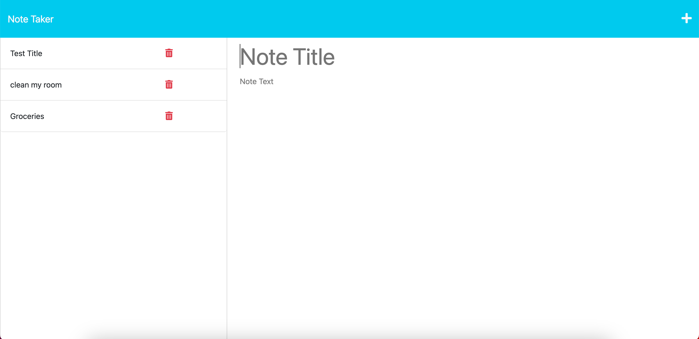

# note-taker

The note taker program records notes in an organized way. To run the program, type the npm start command in the terminal and go to http://localhost3001 in a browser. After clicking the get started button, users are presented with the choice of viewing existing notes or writing a new note. When a note has a title and text, a save button will appear in the top right corner. When the save button is clicked, the note appears in the left column and all the notes are saved in the db.json file. The application's goal is to make a simple, organized way to create and save notes for later. Help was received from a tutor for this project.

## Link to the Deployed Application

https://dock-note-taker.herokuapp.com/

